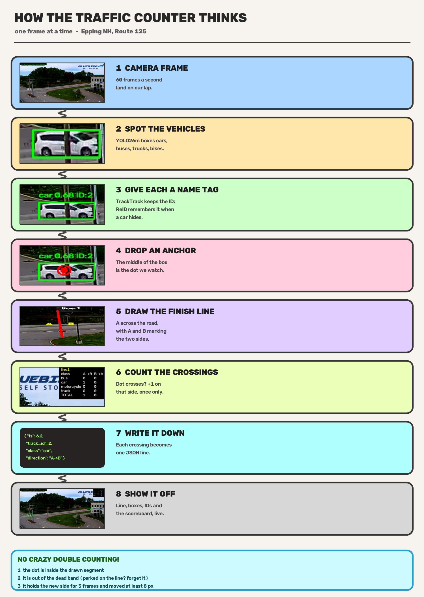

# Contagem de veículos por sentido em câmera de trânsito


## Como rodar

Requer Python 3.12 ou superior. O `requirements.txt` fornece `opencv-python`, `yt-dlp` e
`numpy`; o detector e o PyTorch são instalados à parte, conforme a orientação do desafio.
O peso do detector está em `models/yolo26m.pt` e é baixado pelo Ultralytics na primeira
execução, caso esteja ausente.

```bash
pip install -r requirements.txt
pip install ultralytics
# GPU (opcional, mas recomendado): instalador do PyTorch com CUDA, ex.:
pip install torch torchvision --index-url https://download.pytorch.org/whl/cu130
```

Os comandos de uso são os seguintes.

```bash
python test_crossing.py                          # testes da lógica de cruzamento
python pick_line.py                              # marca a linha, grava line.json
python stream_process.py                          # live (URL default no topo do arquivo)
python stream_process.py -u samples/clip.mp4      # arquivo local
python stream_process.py -u samples/clip.mp4 --no-display --save out.mp4
```

Na janela, a barra de espaço pausa e retoma a execução, e as teclas `q` ou `Esc` a
encerram. A saída consiste em dois arquivos, o `events.jsonl`, com um evento por linha, e
o `summary.json`, com os totais por classe e por sentido. A evidência visual encontra-se
em `samples/evidence_30s.mp4`.

## Decisões tomadas

As decisões recaem sobre três pontos, o detector, o tracker e a localização da linha, e
são apresentadas a seguir com a respectiva justificativa.

### Detector

Empregou-se o `yolo26m` pré-treinado no conjunto COCO, restrito às classes `[2,3,5,7]`,
que correspondem a carro, motocicleta, ônibus e caminhão (`stream_process.py:42-44`). Não
se realizou treinamento nem ajuste fino, pois ambos estão fora do escopo do desafio. O
`yolo26n` foi descartado por gerar falsos positivos e caixas duplicadas em excesso,
enquanto o `yolo26m` apresentou o melhor equilíbrio entre esses erros e o custo. Testaram-se
também o `yolo26l` e a entrada em 960 pixels de altura, e ambos degradaram a contagem:
o primeiro elevou o A→B de 12 para 13 carros, e o segundo fez o mesmo, de modo que a
resolução de 640 pixels foi mantida.

### Tracker

Empregou-se o TrackTrack com configuração própria em `trackers/traffic.yaml`. Quatro
parâmetros diferem do padrão do pacote, com o efeito medido no número de identidades
distintas ao longo do `samples/clip.mp4`.

| parâmetro | padrão | adotado | função | justificativa | identidades distintas |
|---|---|---|---|---|---|
| `track_buffer` | 30 | 90 | número de quadros em que um track perdido permanece vivo antes de ser apagado; a 30 fps, 30 equivalem a 1 s e 90 a 3 s | o veículo da faixa de trás permanece ocluído por mais de 1 s e, com 30, a identidade era apagada e o veículo retornava como novo | nenhum efeito medido (54 nos dois valores) |
| `lost_match_thr` | 0,0 | 0,9 | habilita uma segunda passada de associação, mais branda, para revincular tracks que continuam perdidos; em 0,0 ela fica desabilitada | é o que reatribui o veículo ocluído à identidade anterior, em vez de criar outra | 54 → 42 |
| `with_reid` | False | True | habilita a comparação por aparência, com embedding da caixa, na associação | reconhece o veículo que reaparece pela aparência e não apenas pela posição; usa os atributos do próprio detector (`model: auto`), sem modelo adicional | 42 → 37 |
| `gmc_method` | sparseOptFlow | none | compensação de movimento da câmera entre quadros | a câmera é fixa e não há movimento a compensar; remove o custo do fluxo óptico sem alterar a contagem, e a configuração ficou cerca de 2 ms mais rápida que o padrão | nenhum |

O restante do arquivo permaneceu no padrão, incluindo os limiares de detecção, os pesos de
associação e a inicialização ciente do track (Track-Aware Initialization, TAI). A TAI
suprime a criação de identidades duplicadas e resolve a duplicata na camada correta, sem
descartar detecção.

### Localização da linha

A linha está definida no `line.json` como um segmento quase vertical no terço esquerdo da
via principal, região em que os veículos aparecem maiores e menos ocluídos. A configuração
é feita por arquivo, e o leitor aceita uma lista de linhas (`crossing.py:69`), de modo que
múltiplas vias não exigem alteração de código. A âncora adotada é o centro da caixa
delimitadora.

A contagem reside em `crossing.py:97`. Para cada `track_id`, o sinal do produto vetorial em
relação à linha determina de que lado o veículo se encontra. A travessia é computada apenas
quando o lado se altera com três quadros sustentados, deslocamento mínimo de 8 pixels e ao
menos três observações do track. Uma banda morta de 4 pixels suspende a contagem, o que
resolve o caso do veículo parado sobre a linha. O sentido é derivado da orientação, sendo
A o lado esquerdo de uma linha vertical e o lado superior de uma linha horizontal.

O fluxo completo do pipeline, com recortes reais dos quadros, é mostrado a seguir, e a
linha aparece na etapa 5.



## Trade-offs

Quatro decisões foram tomadas com custo conhecido. A primeira diz respeito à deduplicação:
testou-se remover a caixa contida em 80% dentro de outra, o que resolvia o caso duplicado,
mas interrompia o track dos veículos reais da faixa de trás e trocava a identidade deles;
o problema foi deslocado para o tracker.

A segunda refere-se ao hardware: o tempo real com o `yolo26m` depende de GPU, e em CPU o
melhor resultado obtido foi com o `yolo26s`, ainda assim abaixo de 30 fps.

A terceira trata da resolução de inferência, mantida em 640 pixels, uma vez que 960 não
melhorou a classe e piorou o A→B. A quarta diz respeito à compensação de movimento, com
`gmc_method: none`, já que a câmera é fixa e a contagem permaneceu igual à obtida com
`sparseOptFlow`, sem o custo associado.

Quanto à engenharia de tempo real, adotou-se uma escolha explícita. Como o custo típico
cabe no orçamento de 33,3 ms por quadro, o padrão é processar todos os quadros, que é o que
a contagem requer. Quando a máquina opera em um estado mais carregado e o quadro não cabe,
a alavanca é `--skip-late`, que descarta o quadro atrasado e mantém o pipeline ao vivo, ao
custo de perder um cruzamento que recaia em um quadro descartado. Essa opção não foi
deixada ligada por padrão porque, em um clipe gravado, a contagem vale mais que o tempo
real. As medidas disponíveis para reduzir o tempo por quadro são as seguintes.

| medida | efeito | estado |
|---|---|---|
| descartar quadros (`--skip-late`) | mantém o pipeline ao vivo quando o quadro não cabe, podendo perder um cruzamento | existe, herdado do boilerplate |
| reduzir a resolução de inferência (`imgsz 480`) | 29,1 ms contra 31,6 ms no `track` | medido, efeito na contagem não apurado |
| trocar o detector (`s` ou `n`) | 30,3 e 32,6 ms | medido, não compensa |
| exportar o detector para TensorRT | não apurado | não implementado |
| detectar a cada N quadros (stride) | reduz o custo do `track`; exige alimentar o tracker manualmente, fora do `model.track` | não implementado |
| recortar uma região de interesse em volta da linha | não apurado | não implementado; arriscado, pois o tracker precisa observar o veículo antes de ele chegar à linha |
| sobrepor a leitura com a inferência em uma thread | a leitura custa 2,0 ms | não implementado |

## Limitações conhecidas

O cabeçote de classe do detector troca carro por caminhão em veículo pequeno ou distante,
o que ocorreu uma vez neste clipe; modelo maior e resolução maior agravaram o problema. Na
oclusão longa a identidade ainda se perde, e foram criadas 37 identidades para 32
cruzamentos, de modo que o re-ID reduz o efeito sem eliminá-lo.

O tempo por quadro varia com o estado da máquina, entre 27 e 38 ms nesta sessão; no estado
mais carregado o pipeline fica abaixo dos 30 fps do stream e, sem `--skip-late`, acumula
atraso. O detector é o COCO pronto, sem treinamento nesta cena, o que o desafio não avalia.
Apenas uma linha está configurada, de modo que o fluxo da via do primeiro plano não é
contado. Por fim, o `ts` do evento é relógio de parede e não tempo de vídeo, e em um clipe
ele escorrega conforme a velocidade de processamento.

## O que fazer com mais tempo

Quatro encaminhamentos são sugeridos. Inicialmente, montar um ground truth por veículo, e
não apenas por totais, para atribuir cada erro a um cruzamento específico. Posteriormente,
empregar um encoder de re-ID dedicado, como o `yolo26s-reid.onnx`, no lugar do `model:
auto`, e comparar a contagem com e sem de forma controlada.

Em seguida, configurar mais linhas, uma por eixo do cruzamento, o que o leitor já suporta.
Por fim, separar o timestamp de vídeo do de parede nos eventos. Além desses, permanece em
aberto o item de engenharia de tempo real discutido na seção de trade-offs, com as medidas
que não foram apuradas.

## Evidência visual

O clipe `samples/evidence_30s.mp4` contém o resultado do pipeline, com 960 quadros a 30 fps,
totalizando 32,0 s. Nele figuram a linha, as caixas com a identidade e a tabela de
contadores por classe e por sentido.

## Números

A avaliação foi feita sobre o `samples/clip.mp4`, com 60 s e 1.800 quadros, contado
manualmente como referência. Os totais por sentido e por classe são confrontados a seguir.

| sentido | carro (manual → pipeline) | caminhão (manual → pipeline) |
|---|---|---|
| A→B | 12 → 12 | 5 → 5 |
| B→A | 9 → 10 | 6 → 5 |

O sentido A→B coincidiu integralmente. No B→A o total, 15, é igual ao manual, que soma 9 e
6, porém um veículo foi classificado como carro quando era caminhão. O erro é de rótulo de
classe, e não de contagem dupla, cruzamento perdido ou falso positivo: o cruzamento foi
detectado uma vez, no sentido correto, e os totais por sentido coincidem, 17 e 15.

A acurácia de contagem foi de 32 em 32 cruzamentos, ou 100%, sem dupla, sem perda e sem
falso positivo. A acurácia de rótulo de classe foi de 31 em 32, ou 96,9%. As duas
diferenças por classe estão no B→A, em que o pipeline registra 10 carros para 9 reais e 5
caminhões para 6 reais, o mesmo veículo trocado. Sem o re-ID o B→A somava 14, com um
cruzamento perdido, e a acurácia de contagem caía para 31 em 32, ou 96,9%; com o re-ID os
32 são fechados.

Em relação ao desempenho, a máquina é um Core Ultra 7 155H com 31,5 GB de RAM e uma RTX
4050 Laptop de 6 GB. O tempo por etapa, medido com o `bench_stages.py` em 300 quadros, é
o seguinte.

| etapa | média | mediana | p95 |
|---|---|---|---|
| read | 2,0 ms | 1,9 ms | 2,6 ms |
| track (detecção e associação) | 24,5 ms | 23,9 ms | 30,0 ms |
| count | 0,4 ms | 0,3 ms | 0,6 ms |
| draw | 0,2 ms | 0,2 ms | 0,3 ms |
| HUD | 0,1 ms | 0,1 ms | 0,1 ms |
| total | 27,1 ms | 26,4 ms | 32,6 ms |

O stream é de 30 fps, ou seja 33,3 ms por quadro. O total de 27,1 ms fica dentro do
orçamento, o que corresponde a 36,9 fps, e a etapa `track` responde por 90% desse tempo.
Ao executar o pipeline completo sobre o clipe de 60 s, o último evento saiu com `ts` de
59,97 s, indicando que a execução acompanhou o relógio do vídeo.

O desempenho em CPU é substancialmente pior: o `yolo26s` registrou 93,3 ms, ou 10,7 fps.

Desabilitar o re-ID quase não altera o tempo. Com o mesmo TrackTrack e apenas com
`with_reid: False` no `trackers/_noreid.yaml`, o total foi de 26,05 ms contra 27,08 ms com
o re-ID, uma diferença de cerca de 1 ms, ou 4%. Portanto, o bônus não é o fator que decide
o enquadramento no orçamento; o que pesa é a associação do tracker, na qual o re-ID entra
com custo pequeno.

## Reidentificação

Em relação ao tratamento atual de uma detecção que desaparece e retorna, o TrackTrack
mantém o track perdido vivo por `track_buffer` quadros, 90 neste caso, e tenta revincular
pela posição prevista pelo filtro de Kalman. Sob oclusão curta, a identidade retorna a
mesma e o cruzamento é contado uma vez. Quando o intervalo excede o buffer, a identidade é
apagada e, ao reaparecer, o veículo constitui um track novo. Próximo à linha, isso gera
erro de duas formas: se o veículo desaparece antes de cruzar e reaparece depois, o
cruzamento é perdido; se ele retorna do mesmo lado, o track novo entra neutro e não
duplica, embora um cruzamento futuro dele possa ser contado. Foi o que se observou no
bônus, em que um cruzamento B→A foi perdido sem o re-ID.

Quanto ao uso da re-identificação, três sinais foram combinados. O primeiro é a aparência,
com o embedding da caixa, que corresponde ao `with_reid` habilitado sobre os atributos do
próprio detector. O segundo é o movimento previsto, ou seja, a posição projetada do track
perdido. O terceiro é a geometria da via, o prior de que o veículo reaparece adiante na
direção do fluxo. Nesta cena a geometria é forte, pois a câmera é fixa e o fluxo tem faixa
definida, de modo que a busca do candidato fica restrita a um cone à frente, e não à imagem
inteira. A aparência isolada confunde veículos semelhantes, e o movimento isolado confunde
trajetórias que se cruzam; a combinação dos dois com o prior de faixa é o que se mostrou
adequado.

Em relação ao custo, a re-identificação acrescenta trabalho por detecção, o embedding e o
cálculo de similaridade. Neste trabalho ela não encareceu, pois o `gmc_method: none`
economizou mais do que o re-ID gastou, e a configuração ficou cerca de 2 ms mais rápida que
o padrão. A escolha passa a valer a pena quando a oclusão típica excede o `track_buffer`.

Por fim, a re-identificação pode piorar a contagem quando mal calibrada. Um limiar de
aparência baixo funde veículos diferentes, de modo que dois carros escuros passam a
constituir uma única identidade, o que perde contagem; um limiar alto demais nunca
revincular, e o cruzamento perdido retorna. Além disso, revincular o lado errado da linha
inverte o sentido do cruzamento. Por isso a decisão da re-identificação é tomada apenas
quando aparência, movimento e geometria concordam, nunca com base apenas na aparência.
